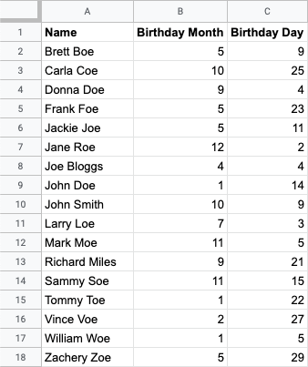
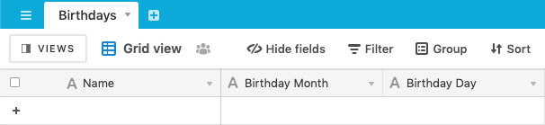
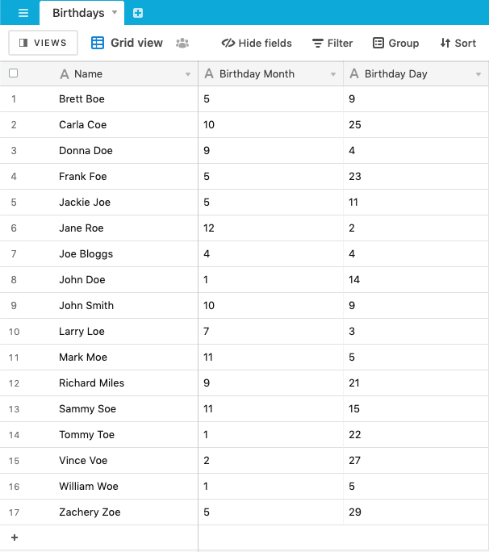

# Google Sheets to Airtable

## Project Overview

This project contains an example of how to copy rows from a Google Sheet over to an Airtable Base. It uses the [googlesheets.values.retrieve](https://autocode.com/stdlib/googlesheets/values/#retrieve) and [airtable.records.create](https://autocode.com/stdlib/airtable/records/#create) APIs from Autocode's Standard Library. You can deploy your own working version of this project in just a few clicks with Autocode.

Click the button above to open this project in Autocode, and create a Google Sheet similar to the one in the image below, and create a copy of the sample base on your own Airtable account by clicking this link: https://airtable.com/addBaseFromShare/shrTrHR45VaNfNI1l. Then, link your Google Sheet and Airtable Base to your project in Autocode and insert your Sheet ID in the **googlesheets.values.retrieve** API then deploy!

Like all Autocode templates, the endpoints and whatever data you want to copy over and format in both Google Sheets and Airtable are completely customizable in this project –– everything is code that you can edit and test using the Autocode editor.

## Endpoints

The endpoint is accessible via HTTP. You can make calls to them via the [lib-js](https://github.com/stdlib/lib-js) frontend package, or directly to the URL using `fetch` or any other HTTP client you prefer.

### functions/copy.js

This endpoint will retrieve all the rows from the linked Google Sheet, loop through their values, and create records over in the linked Airtable Base.

## Thank You!

Please check out [Autocode](https://autocode.com) or follow us on Twitter, [@AutocodeHQ](https://twitter.com/AutocodeHQ).
